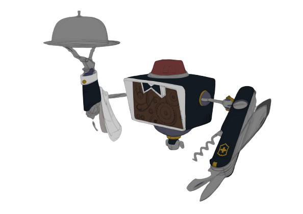

<!-- Improved compatibility of back to top link: See: https://github.com/othneildrew/Best-README-Template/pull/73 -->
<a name="readme-top"></a>
<!--
*** Thanks for checking out the Best-README-Template. If you have a suggestion
*** that would make this better, please fork the repo and create a pull request
*** or simply open an issue with the tag "enhancement".
*** Don't forget to give the project a star!
*** Thanks again! Now go create something AMAZING! :D
-->


<!-- PROJECT SHIELDS -->
<!--
*** I'm using markdown "reference style" links for readability.
*** Reference links are enclosed in brackets [ ] instead of parentheses ( ).
*** See the bottom of this document for the declaration of the reference variables
*** for contributors-url, forks-url, etc. This is an optional, concise syntax you may use.
*** https://www.markdownguide.org/basic-syntax/#reference-style-links
-->
[![Contributors][contributors-shield]][contributors-url]
[![Forks][forks-shield]][forks-url]
[![Stargazers][stars-shield]][stars-url]
[![Issues][issues-shield]][issues-url]
[![MIT License][license-shield]][license-url]


<!-- PROJECT LOGO -->
<br />
<div align="center">
  <a href="https://github.com/RobutlerAlberto/RobutlerAlberto">
    
  </a>

<h3 align="center">Robutler Alberto</h3>

  <p align="center">
    Repository for a Robot Butler project developed for the course of Programming of Robotic Systems at the University of Aveiro, 2022/2023.
    <br />
    <a href="https://github.com/RobutlerAlberto/RobutlerAlberto/wiki"><strong>Explore the Wiki »</strong></a>
    <br />
    <br />
    <a href="https://youtu.be">View Demo</a>
    ·
    <a href="https://github.com/RobutlerAlberto/RobutlerAlberto/issues">Report Bug</a>
    ·
    <a href="https://github.com/RobutlerAlberto/RobutlerAlberto/issues">Request Feature</a>
  </p>
</div>


<!-- TABLE OF CONTENTS -->
<details>
  <summary>Table of Contents</summary>
  <ol>
    <li>
      <a href="#about-the-project">About The Project</a>
    </li>
    <li>
      <a href="#getting-started">Getting Started</a>
      <ul>
        <li><a href="#prerequisites">Prerequisites</a></li>
        <li><a href="#installation">Installation</a></li>
      </ul>
    </li>
    <li><a href="#usage">Usage</a></li>
    <li><a href="#contributing">Contributing</a></li>
    <li><a href="#license">License</a></li>
    <li><a href="#contact">Contact</a></li>
    <li><a href="#acknowledgments">Acknowledgments</a></li>
  </ol>
</details>


<!-- ABOUT THE PROJECT -->
## About The Project
<div align="center">

</div>

This project was developed for Robotics Systems Programing class for the third report. The objective is to develop a robotic system that works as a butler. The robutler must be able to complete several support missions normally realized by humans. Also, there must be implemented functionalities that guarantee the viability of the missions, such as object detection and possibility of dislocation inside the scenery.   

<p align="right">(<a href="#readme-top">back to top</a>)</p>


<!-- ### Built With

* [![Next][Next.js]][Next-url]
* [![React][React.js]][React-url]
* [![Vue][Vue.js]][Vue-url]
* [![Angular][Angular.io]][Angular-url]
* [![Svelte][Svelte.dev]][Svelte-url]
* [![Laravel][Laravel.com]][Laravel-url]
* [![Bootstrap][Bootstrap.com]][Bootstrap-url]
* [![JQuery][JQuery.com]][JQuery-url]

<p align="right">(<a href="#readme-top">back to top</a>)</p> -->


<!-- GETTING STARTED -->
## Getting Started

This project is written in python with [ROS Noetic](http://wiki.ros.org/ROS/Installation) to control all the aspects of the robot and its communication. To do object detection is used the [OpenCV](https://opencv.org/) library and [YOLO](/https://pjreddie.com/darknet/yolo/).
***
### Prerequisites

To use this code, first you need to download the .cfg and .weights file from [YOLO](https://github.com/AlexeyAB/darknet/). You can either get the tiny yolov3 in [yolov3-tiny.cfg](https://github.com/pjreddie/darknet/blob/master/cfg/yolov3-tiny.cfg) and [yolov3-tiny.weights](https://pjreddie.com/media/files/yolov3-tiny.weights) (this one is already in this repo) or any other version. Just make sure you put both these files inside the folder `alberto_vision/src`.

***
### Installation
To install the project, clone the repository inside the *src* folder of your *catkin_ws*, running the following lines:
```
git clone https://github.com/RobutlerAlberto/RobutlerAlberto.git
cd ..
catkin_make
```

To install all the dependencies of this package, just run in your terminal:
```
roscd alberto_bringup
cd ..
pip install -r requirements.txt
```


<p align="right">(<a href="#readme-top">back to top</a>)</p>

<!-- USAGE EXAMPLES -->
## Usage

### Train Model
To Train the model, run the code:
```
rosrun dora_the_mug_finder_bringup model_train.py -fn <folder_name> -mn <model_name> -n_epochs 50 -batch_size 256 -c 0
```

Where the __*<folder_name>*__ and __*<model_name>*__  should be replaced by the names you want to give. 

***
### Run Object extractor and classifier
To run the detector with previous trained model run the code:
```
roslaunch dora_the_mug_finder_bringup dora_bringup.launch mn:=<model_name> fn:=<folder_name>
```
Where the __*<folder_name>*__ and __*<model_name>*__ should be replaced by a name for the model previously set while training. 
If you want to visualize extracted images run:
```
roslaunch dora_the_mug_finder_bringup dora_bringup.launch mn:=<model_name> fn:=<folder_name> visualize:=True
```
It's also possible to add the argument __*audio*__ to initialize audio describing the objects, setting it to true:
```
roslaunch dora_the_mug_finder_bringup dora_bringup.launch mn:=<model_name> fn:=<folder_name> audio:=true
```

***
### Run Kinect
It's also possible to use a kinect camera for processing in real time, by adding the __*kinect*__ argument:
```
roslaunch dora_the_mug_finder_bringup dora_bringup.launch mn:=<model_name> fn:=<folder_name> kinect:=true
```
<p align="right">(<a href="#readme-top">back to top</a>)</p>

<!-- CONTRIBUTING -->
## Contributing

If you have a suggestion that would make this better, please fork the repo and create a pull request. You can also simply open an issue with the tag "enhancement".
Don't forget to give the project a star! Thanks again!

1. Fork the Project
2. Create your Feature Branch (`git checkout -b feature/AmazingFeature`)
3. Commit your Changes (`git commit -m 'Add some AmazingFeature'`)
4. Push to the Branch (`git push origin feature/AmazingFeature`)
5. Open a Pull Request

<p align="right">(<a href="#readme-top">back to top</a>)</p>


<!-- LICENSE -->
## License

Distributed under the GPL License. See `license.txt` for more information.

<p align="right">(<a href="#readme-top">back to top</a>)</p>


<!-- CONTACT -->
## Contact

Bruno Silva - bruno.favs@ua.pt

Fábio Sousa - fabiorsousa81@ua.pt

Isabel Rosário - isabel.rosario@ua.pt

Project Link: [Robutler Alberto](https://github.com/RobutlerAlberto/RobutlerAlberto)

<p align="right">(<a href="#readme-top">back to top</a>)</p>


<!-- ACKNOWLEDGMENTS -->
## Acknowledgments

* Professor Miguel Oliveira - mriem@ua.pt

<p align="right">(<a href="#readme-top">back to top</a>)</p>


<!-- MARKDOWN LINKS & IMAGES -->
<!-- https://www.markdownguide.org/basic-syntax/#reference-style-links -->
[contributors-shield]: https://img.shields.io/github/contributors/RobutlerAlberto/RobutlerAlberto.svg?style=for-the-badge
[contributors-url]: https://github.com/RobutlerAlberto/RobutlerAlberto/graphs/contributors
[forks-shield]: https://img.shields.io/github/forks/RobutlerAlberto/RobutlerAlberto.svg?style=for-the-badge
[forks-url]: https://github.com/RobutlerAlberto/RobutlerAlberto/network/members
[stars-shield]: https://img.shields.io/github/stars/RobutlerAlberto/RobutlerAlberto.svg?style=for-the-badge
[stars-url]: https://github.com/RobutlerAlberto/RobutlerAlberto/stargazers
[issues-shield]: https://img.shields.io/github/issues/RobutlerAlberto/RobutlerAlberto.svg?style=for-the-badge
[issues-url]: https://github.com/RobutlerAlberto/RobutlerAlberto/issues
[license-shield]: https://img.shields.io/github/license/RobutlerAlberto/RobutlerAlberto.svg?style=for-the-badge
[license-url]: https://github.com/RobutlerAlberto/RobutlerAlberto/blob/master/LICENSE.txt
[product-screenshot]: docs/logo.png
